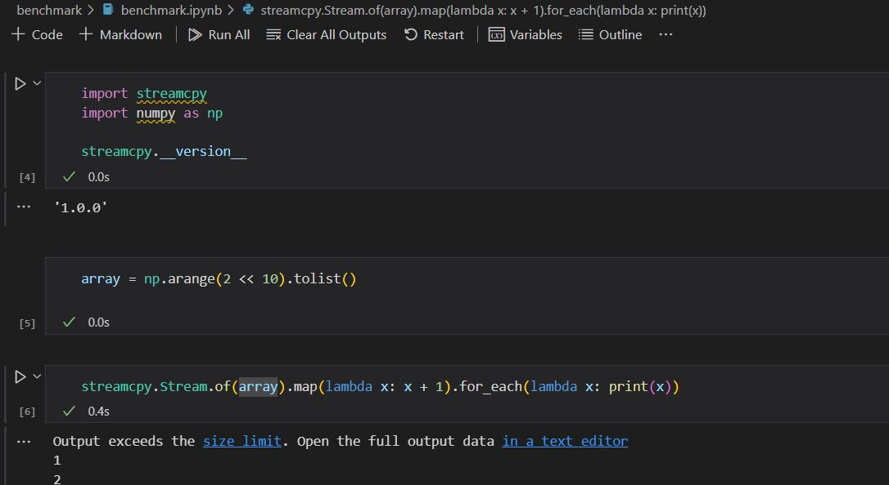
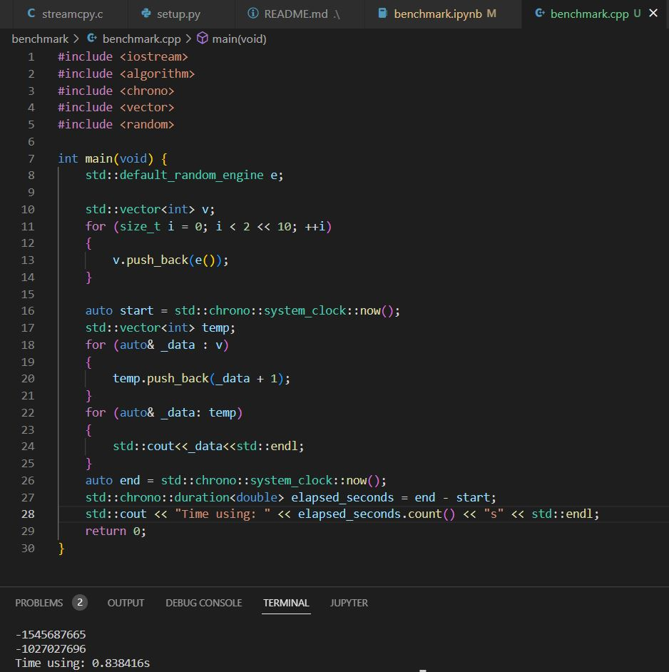

# Benchmark for streamcpy vs C++

## Prerequest

The environment of the banchmark test is below:

|Type|Detail|
|:---|:------|
|OS| Windows 10 19044.2728|
|CPU| Intel Core i7-8750H 64bit|
|Compiler| MSVC 14.35.32215.0 (Visual Studio 2022)|
|Python| 3.8.2|

## Rule

The code in Python or C++ needs to implement a `map` operation and a `for_each` operation. The volume of the data is 2 << 10 but the content is arbitrary(sequentially or randomly). Timers used in this case must invoke the __system call__ and only conclude the two operations above.

## Result

**The Python implementation is faster than C++!**

Here is the detail:

|Type|Python|C++|
|:---|:-----|:--|
|Time|~0.4s*|0.838416s|
|Timer used|jupyter internal|chrono in C++11|

> *NOTE: Since the timer used for Python is from the jupyter notebook, the ressult may not be very precise. We need double check the result of the case. Also, MSVC can optimize the code and shorten the time. For example, if I skip the `for_each` operation, C++'s will run faster.

